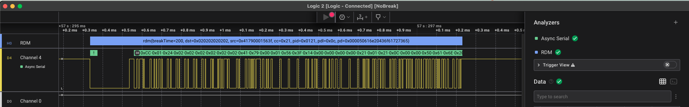

## RDM - Remote Device Management - ANSI E1.20 Analyzer for Saleae Logic 2

## Usage
Parse RDM frames captured from RS-485 lines. Use with Async Serial as input.

---
### To Do:
1. Add parsing for the DISC_UNIQUE_BRANCH response
2. Add parsing for DEVICE_INFO payload and other common commands
3. Warn user on RDM commands with no reply while expected
4. Support for interlaced DMX frames (either from Async-serial or DMX-512 analyzer)